# Projeto de Computação em Nuvem

## 📋 Descrição
Sistema de microsserviços para encurtador de URL implementado na AWS usando Terraform como Infraestrutura como Código (IaC). O projeto demonstra conceitos fundamentais de computação em nuvem, incluindo desacoplamento de serviços, escalabilidade e tolerância a falhas.

## 🏗️ Arquitetura
- **Arquitetura**: Microsserviços com comunicação assíncrona
- **Infraestrutura**: AWS (ECS Fargate, ALB, VPC, SQS)
- **IaC**: Terraform
- **Comunicação**: AWS SQS (Simple Queue Service)
- **Containerização**: Docker + Amazon ECR
- **CI/CD**: GitHub Actions com deploy automático
- **Observabilidade**: CloudWatch Logs + Container Insights

### 🔄 Pipeline CI/CD


### 🏛️ Arquitetura AWS


**Pipeline Automático:**
- ✅ **Validação de código** (linting, testes, security scan)
- 🐳 **Build AMD64** das imagens Docker
- 📦 **Push automático** para Amazon ECR
- 🚀 **Deploy no ECS** com atualizações rolling
- 🧪 **Testes de integração** pós-deploy
- 📢 **Notificações** de status

## 📁 Estrutura do Projeto
```
projeto-computacao-nuvem/
├── .github/                      # GitHub Actions (CI/CD)
│   └── workflows/               # Workflows de automação
│       ├── deploy.yml          # Pipeline principal de deploy
│       └── pr-validation.yml   # Validação de Pull Requests
├── iac/                          # Infraestrutura como Código (Terraform)
│   ├── main.tf                  # Recursos principais AWS
│   ├── variables.tf             # Variáveis de configuração
│   └── outputs.tf               # Outputs da infraestrutura
├── src/                          # Código-fonte dos microsserviços
│   ├── api-service/             # Serviço de API REST
│   │   ├── app.py              # Aplicação Flask
│   │   ├── requirements.txt    # Dependências Python
│   │   └── Dockerfile          # Container da API
│   └── processing-service/      # Serviço de processamento
│       ├── worker.py           # Worker SQS
│       ├── requirements.txt    # Dependências Python
│       └── Dockerfile          # Container do worker
├── scripts/                     # Scripts de automação
│   └── deploy.sh               # Script de deploy local (fallback)
├── .flake8                      # Configuração de linting Python
├── .gitignore                   # Arquivos a serem ignorados pelo Git
├── pyproject.toml               # Configuração Black/isort
├── LICENSE                      # Licença MIT do projeto
├── CICD-SETUP.md                # Guia de configuração CI/CD
├── arquitetura-aws.svg          # Diagrama da arquitetura AWS
├── ci-cd.svg                    # Diagrama do pipeline CI/CD
├── RELATORIO.md                 # Relatório técnico detalhado
└── README.md                    # Este arquivo
```

## 🔧 Pré-requisitos

### Software Necessário
- **AWS CLI** (v2.x): Para interação com a AWS
- **Terraform** (≥ 1.0): Para provisionamento da infraestrutura
- **Docker** (≥ 20.x): Para build das imagens
- **curl**: Para testes da API

### Instalação das Dependências

#### macOS (usando Homebrew)
```bash
# AWS CLI
brew install awscli

# Terraform
brew install terraform

# Docker Desktop
brew install --cask docker
```

#### Ubuntu/Debian
```bash
# AWS CLI
curl "https://awscli.amazonaws.com/awscli-exe-linux-x86_64.zip" -o "awscliv2.zip"
unzip awscliv2.zip
sudo ./aws/install

# Terraform
wget -O- https://apt.releases.hashicorp.com/gpg | sudo gpg --dearmor -o /usr/share/keyrings/hashicorp-archive-keyring.gpg
echo "deb [signed-by=/usr/share/keyrings/hashicorp-archive-keyring.gpg] https://apt.releases.hashicorp.com $(lsb_release -cs) main" | sudo tee /etc/apt/sources.list.d/hashicorp.list
sudo apt update && sudo apt install terraform

# Docker
sudo apt install docker.io docker-compose
sudo usermod -aG docker $USER
```

## ⚙️ Configuração

### 1. Configurar Credenciais AWS
```bash
# Configurar AWS CLI com suas credenciais
aws configure

# Inserir quando solicitado:
# AWS Access Key ID: [sua-access-key]
# AWS Secret Access Key: [sua-secret-key]
# Default region name: us-east-1
# Default output format: json

# Verificar configuração
aws sts get-caller-identity
```

**Nota**: Certifique-se de que sua conta AWS tem as permissões necessárias para criar recursos ECS, VPC, ALB, SQS, ECR e IAM.

**Permissões IAM Necessárias:**
- `AmazonECS_FullAccess`
- `AmazonEC2FullAccess`
- `AmazonSQSFullAccess`
- `AmazonEC2ContainerRegistryFullAccess`
- `IAMFullAccess`
- `ElasticLoadBalancingFullAccess`
- `CloudWatchFullAccess`

### 2. Inicializar Terraform
```bash
cd projeto-computacao-nuvem/iac

# Inicializar Terraform
terraform init

# Verificar plano de execução
terraform plan

# Aplicar infraestrutura (confirmação necessária)
terraform apply
```

**⏱️ Tempo estimado**: 15-20 minutos para provisionamento completo.

### 3. Verificar Outputs da Infraestrutura
```bash
# Ver outputs importantes
terraform output

# Exemplos de outputs esperados:
# api_endpoint = "http://url-shortener-dev-alb-123456789.us-east-1.elb.amazonaws.com"
# ecs_cluster_name = "url-shortener-dev-cluster"
# sqs_queue_url = "https://sqs.us-east-1.amazonaws.com/123456789/url-shortener-dev-url-processing"
```

## 🚀 Deploy da Aplicação

### 🎯 **CI/CD Automático (Recomendado)**

O projeto inclui **pipeline completo de CI/CD** com GitHub Actions que automatiza todo o processo de deploy:

```bash
# 1. Configure os secrets no GitHub (uma vez):
# AWS_ACCESS_KEY_ID e AWS_SECRET_ACCESS_KEY

# 2. Faça push para main/master:
git add .
git commit -m "feat: nova funcionalidade"
git push origin main

# 🎉 Pipeline executa automaticamente:
# ✅ Testes e validações
# 🐳 Build AMD64 das imagens
# 📦 Push para ECR
# 🚀 Deploy no ECS
# 🧪 Testes de integração
```

**Vantagens do CI/CD:**
- ✅ **Resolve problema de arquitetura** (AMD64 automático)
- ⚡ **Deploy em ~5 minutos** vs ~15 minutos manual
- 🛡️ **Validações automáticas** de código e segurança
- 📊 **Relatórios detalhados** de cada execução
- 🔄 **Rollback automático** em caso de falhas

📖 **Guia completo**: Ver `CICD-SETUP.md`

### 🔧 Deploy Local (Fallback)
```bash
# Executar deploy completo
./scripts/deploy.sh

# Verificar apenas saúde dos serviços
./scripts/deploy.sh health

# Ver opções de ajuda
./scripts/deploy.sh --help
```

### Deploy Manual (Alternativo)

#### 1. Login no ECR
```bash
aws ecr get-login-password --region us-east-1 | \
    docker login --username AWS --password-stdin $(aws sts get-caller-identity --query Account --output text).dkr.ecr.us-east-1.amazonaws.com
```

#### 2. Build e Push das Imagens
```bash
# API Service
cd src/api-service
docker build -t url-shortener-api:latest .
docker tag url-shortener-api:latest $(terraform -chdir=../../iac output -raw api_service_ecr_repository_url):latest
docker push $(terraform -chdir=../../iac output -raw api_service_ecr_repository_url):latest

# Processing Service
cd ../processing-service
docker build -t url-shortener-processing:latest .
docker tag url-shortener-processing:latest $(terraform -chdir=../../iac output -raw processing_service_ecr_repository_url):latest
docker push $(terraform -chdir=../../iac output -raw processing_service_ecr_repository_url):latest
```

#### 3. Atualizar Serviços ECS
```bash
# Forçar novo deployment
aws ecs update-service \
    --cluster $(terraform -chdir=iac output -raw ecs_cluster_name) \
    --service url-shortener-dev-api-service \
    --force-new-deployment

aws ecs update-service \
    --cluster $(terraform -chdir=iac output -raw ecs_cluster_name) \
    --service url-shortener-dev-processing-service \
    --force-new-deployment
```

## 🧪 Testando a Aplicação

### 1. Verificar Health Check
```bash
# Obter endpoint da API
API_ENDPOINT=$(terraform -chdir=iac output -raw api_endpoint)

# Testar health check
curl $API_ENDPOINT/health
```

**Resposta esperada**:
```json
{
  "status": "healthy",
  "service": "api-service",
  "timestamp": "2024-01-XX:XX:XX.XXXXXX",
  "version": "1.0.0"
}
```

### 2. Testar Encurtamento de URL
```bash
# Encurtar uma URL
curl -X POST $API_ENDPOINT/shorten \
  -H "Content-Type: application/json" \
  -d '{"url": "https://www.example.com/very/long/url/path"}'
```

**Resposta esperada**:
```json
{
  "success": true,
  "data": {
    "original_url": "https://www.example.com/very/long/url/path",
    "short_url": "https://short.ly/abc12345",
    "short_code": "abc12345",
    "message_id": "12345678-1234-1234-1234-123456789012",
    "created_at": "2024-01-XX:XX:XX.XXXXXX"
  }
}
```

### 3. Verificar Processamento
```bash
# Ver logs do Processing Service
aws logs tail /ecs/url-shortener-dev --follow --filter-pattern="Processing" --region us-east-1
```

### 4. Outros Endpoints Úteis
```bash
# Informações da API
curl $API_ENDPOINT/

# Estatísticas do serviço
curl $API_ENDPOINT/stats
```

### 5. Teste de Carga
```bash
# Múltiplas requisições simultâneas para testar escalabilidade
for i in {1..50}; do
  curl -X POST $API_ENDPOINT/shorten \
    -H "Content-Type: application/json" \
    -d "{\"url\": \"https://example.com/test-$i\"}" &
done

# Aguardar conclusão
wait

echo "Teste de carga concluído!"
```

## 📊 Monitoramento

### CloudWatch Logs
```bash
# Ver logs da API
aws logs tail /ecs/url-shortener-dev --follow --filter-pattern="api-service" --region us-east-1

# Ver logs do Processing Service
aws logs tail /ecs/url-shortener-dev --follow --filter-pattern="processing-service" --region us-east-1

# Ver logs de todas as aplicações
aws logs tail /ecs/url-shortener-dev --follow --region us-east-1
```

### Status dos Serviços ECS
```bash
aws ecs describe-services \
    --cluster $(terraform -chdir=iac output -raw ecs_cluster_name) \
    --services url-shortener-dev-api-service url-shortener-dev-processing-service \
    --query 'services[*].[serviceName,runningCount,desiredCount,taskDefinition]' \
    --output table
```

### Monitoramento da Fila SQS
```bash
# Ver atributos da fila
aws sqs get-queue-attributes \
    --queue-url $(terraform -chdir=iac output -raw sqs_queue_url) \
    --attribute-names All

# Verificar número de mensagens na fila
aws sqs get-queue-attributes \
    --queue-url $(terraform -chdir=iac output -raw sqs_queue_url) \
    --attribute-names ApproximateNumberOfMessages,ApproximateNumberOfMessagesNotVisible
```

### Métricas do ALB
```bash
# Ver target groups saudáveis
aws elbv2 describe-target-health \
    --target-group-arn $(aws elbv2 describe-target-groups \
        --names url-shortener-dev-api-tg \
        --query 'TargetGroups[0].TargetGroupArn' \
        --output text)
```

## 🔧 Configurações Avançadas

### Escalabilidade
Para ajustar o número de instâncias dos serviços:

```bash
# Escalar API Service para 3 instâncias
aws ecs update-service \
    --cluster $(terraform -chdir=iac output -raw ecs_cluster_name) \
    --service url-shortener-dev-api-service \
    --desired-count 3

# Escalar Processing Service para 5 instâncias
aws ecs update-service \
    --cluster $(terraform -chdir=iac output -raw ecs_cluster_name) \
    --service url-shortener-dev-processing-service \
    --desired-count 5

# Verificar escalabilidade
aws ecs describe-services \
    --cluster $(terraform -chdir=iac output -raw ecs_cluster_name) \
    --services url-shortener-dev-api-service url-shortener-dev-processing-service \
    --query 'services[*].[serviceName,runningCount,desiredCount]' \
    --output table
```

### Configuração de Auto Scaling
```bash
# Registrar serviço para auto scaling
aws application-autoscaling register-scalable-target \
    --service-namespace ecs \
    --scalable-dimension ecs:service:DesiredCount \
    --resource-id service/$(terraform -chdir=iac output -raw ecs_cluster_name)/url-shortener-dev-api-service \
    --min-capacity 2 \
    --max-capacity 10

# Criar política de escalonamento baseada em CPU
aws application-autoscaling put-scaling-policy \
    --service-namespace ecs \
    --scalable-dimension ecs:service:DesiredCount \
    --resource-id service/$(terraform -chdir=iac output -raw ecs_cluster_name)/url-shortener-dev-api-service \
    --policy-name cpu-scaling \
    --policy-type TargetTrackingScaling \
    --target-tracking-scaling-policy-configuration file://scaling-policy.json
```

### Variáveis de Ambiente (Processing Service)
Para ajustar configurações do worker, edite `iac/main.tf`:

```hcl
environment = [
  {
    name  = "POLL_INTERVAL"
    value = "10"  # Intervalo de polling em segundos
  },
  {
    name  = "MAX_MESSAGES"
    value = "20"  # Máximo de mensagens por batch
  },
  {
    name  = "VISIBILITY_TIMEOUT"
    value = "60"  # Timeout de visibilidade em segundos
  }
]
```

Após alterar, aplique as mudanças:
```bash
cd iac
terraform plan
terraform apply
./scripts/deploy.sh
```

## 🧹 Limpeza de Recursos

### Destruir Infraestrutura
```bash
cd iac

# Ver recursos que serão destruídos
terraform plan -destroy

# Destruir (confirmação necessária)
terraform destroy
```

**⚠️ Aviso**: Isso removerá TODOS os recursos AWS criados pelo projeto.

### Limpeza Local
```bash
# Remover imagens Docker locais
docker system prune -a -f

# Remover estado do Terraform (opcional)
rm -rf iac/.terraform iac/terraform.tfstate*

# Remover logs locais
rm -rf iac/.terraform.lock.hcl
```

### Verificação de Limpeza
```bash
# Verificar se recursos foram removidos
aws ecs list-clusters --query 'clusterArns[?contains(@, `url-shortener`)]'
aws ec2 describe-vpcs --query 'Vpcs[?Tags[?Key==`Project` && Value==`url-shortener`]]'
aws sqs list-queues --queue-name-prefix url-shortener
```

## 🐛 Troubleshooting

### Problemas Comuns

#### 1. "Credenciais AWS não configuradas"
```bash
# Verificar configuração atual
aws configure list

# Reconfigurar se necessário
aws configure

# Testar acesso
aws sts get-caller-identity
```

#### 2. "Terraform apply falha"
```bash
# Verificar permissões IAM
aws iam get-user
aws iam list-attached-user-policies --user-name $(aws sts get-caller-identity --query User.UserName --output text)

# Verificar limites de recursos
aws service-quotas list-service-quotas --service-code ecs

# Limpar estado corrompido
terraform refresh
terraform plan
```

#### 3. "Deploy falha no push para ECR"
```bash
# Verificar login no ECR
aws ecr get-login-password --region us-east-1 | \
    docker login --username AWS --password-stdin \
    $(aws sts get-caller-identity --query Account --output text).dkr.ecr.us-east-1.amazonaws.com

# Verificar repositórios ECR
aws ecr describe-repositories

# Limpar cache do Docker
docker system prune -f
```

#### 4. "Serviços ECS não iniciam"
```bash
# Verificar logs detalhados do ECS
aws ecs describe-services \
    --cluster $(terraform -chdir=iac output -raw ecs_cluster_name) \
    --services url-shortener-dev-api-service \
    --query 'services[0].events[0:5]'

# Verificar task definitions
aws ecs describe-task-definition \
    --task-definition url-shortener-dev-api-service

# Verificar logs das tasks que falharam
aws logs describe-log-streams \
    --log-group-name /ecs/url-shortener-dev \
    --order-by LastEventTime \
    --descending

# Ver logs de uma task específica
aws ecs list-tasks \
    --cluster $(terraform -chdir=iac output -raw ecs_cluster_name) \
    --service-name url-shortener-dev-api-service

# Verificar eventos da task
aws ecs describe-tasks \
    --cluster $(terraform -chdir=iac output -raw ecs_cluster_name) \
    --tasks [TASK_ARN]
```

#### 5. "API não responde"
```bash
# Verificar se ALB está healthy
aws elbv2 describe-load-balancers \
    --names url-shortener-dev-alb

# Verificar target groups
aws elbv2 describe-target-health \
    --target-group-arn $(aws elbv2 describe-target-groups \
        --names url-shortener-dev-api-tg \
        --query 'TargetGroups[0].TargetGroupArn' \
        --output text)

# Verificar Security Groups
aws ec2 describe-security-groups \
    --filters "Name=tag:Name,Values=url-shortener-dev-alb-sg"

# Testar conectividade direta
API_ENDPOINT=$(terraform -chdir=iac output -raw api_endpoint)
timeout 10 bash -c "</dev/tcp/${API_ENDPOINT#http://}/80" && echo "Conexão OK" || echo "Falha na conexão"
```

#### 6. "SQS não processa mensagens"
```bash
# Verificar fila SQS
aws sqs get-queue-attributes \
    --queue-url $(terraform -chdir=iac output -raw sqs_queue_url) \
    --attribute-names All

# Verificar Dead Letter Queue
aws sqs get-queue-attributes \
    --queue-url $(terraform -chdir=iac output -raw sqs_dlq_url) \
    --attribute-names All

# Enviar mensagem de teste
aws sqs send-message \
    --queue-url $(terraform -chdir=iac output -raw sqs_queue_url) \
    --message-body '{"test": "message"}'

# Verificar permissões IAM do ECS Task Role
aws iam get-role-policy \
    --role-name url-shortener-dev-ecs-task-role \
    --policy-name url-shortener-dev-sqs-access
```

### Logs Úteis
```bash
# Logs do Terraform com debug
export TF_LOG=DEBUG
terraform apply

# Logs detalhados do AWS CLI
aws --debug ecs describe-services ...

# Logs da aplicação em tempo real
aws logs tail /ecs/url-shortener-dev --follow --since 30m

# Logs de erro específicos
aws logs filter-log-events \
    --log-group-name /ecs/url-shortener-dev \
    --filter-pattern "ERROR"

# Logs de uma task específica
aws logs get-log-events \
    --log-group-name /ecs/url-shortener-dev \
    --log-stream-name api-service/api-service/[TASK_ID]
```

### Comandos de Diagnóstico
```bash
# Status geral do projeto
echo "=== STATUS GERAL ==="
echo "AWS Account: $(aws sts get-caller-identity --query Account --output text)"
echo "Region: $(aws configure get region)"
echo "VPC: $(terraform -chdir=iac output -raw vpc_id 2>/dev/null || echo 'N/A')"
echo "API Endpoint: $(terraform -chdir=iac output -raw api_endpoint 2>/dev/null || echo 'N/A')"

# Health check completo
echo "=== HEALTH CHECK ==="
API_ENDPOINT=$(terraform -chdir=iac output -raw api_endpoint 2>/dev/null)
if [ -n "$API_ENDPOINT" ]; then
    curl -s "$API_ENDPOINT/health" | jq . || echo "API não disponível"
else
    echo "Infraestrutura não provisionada"
fi

# Status dos serviços
echo "=== SERVIÇOS ECS ==="
aws ecs describe-services \
    --cluster $(terraform -chdir=iac output -raw ecs_cluster_name 2>/dev/null) \
    --services url-shortener-dev-api-service url-shortener-dev-processing-service \
    --query 'services[*].[serviceName,runningCount,desiredCount,lastStatus]' \
    --output table 2>/dev/null || echo "Serviços não encontrados"
```

## 📚 Documentação Adicional

### Links Úteis
- **Arquitetura Detalhada**: Ver `RELATORIO.md`
- **AWS ECS Documentation**: https://docs.aws.amazon.com/ecs/
- **Terraform AWS Provider**: https://registry.terraform.io/providers/hashicorp/aws/
- **Flask Documentation**: https://flask.palletsprojects.com/
- **Boto3 Documentation**: https://boto3.amazonaws.com/v1/documentation/
- **Docker Best Practices**: https://docs.docker.com/develop/dev-best-practices/

### Comandos de Referência Rápida
```bash
# Setup inicial
aws configure
cd iac && terraform init && terraform apply
cd .. && ./scripts/deploy.sh

# Teste básico
curl $(terraform -chdir=iac output -raw api_endpoint)/health

# Monitoramento
aws logs tail /ecs/url-shortener-dev --follow

# Escalabilidade
aws ecs update-service --cluster CLUSTER --service SERVICE --desired-count N

# Limpeza
cd iac && terraform destroy
```

## 🤝 Contribuição

Este é um projeto educacional para demonstração de conceitos de Computação em Nuvem. Para melhorias:

1. Fork o repositório
2. Crie uma branch para sua feature (`git checkout -b feature/nova-funcionalidade`)
3. Faça commit das mudanças (`git commit -am 'Add nova funcionalidade'`)
4. Push para a branch (`git push origin feature/nova-funcionalidade`)
5. Abra um Pull Request

### Área de Melhorias
- [ ] Implementação de banco de dados real (RDS/DynamoDB)
- [ ] Sistema de cache com ElastiCache
- [ ] Autenticação com Cognito
- [ ] Monitoramento com Prometheus/Grafana
- [ ] Deploy multi-região
- [ ] Testes automatizados (unit/integration)

## 📄 Licença

Este projeto está licenciado sob a **MIT License** - veja o arquivo [LICENSE](LICENSE) para detalhes.

### Uso Educacional
Este projeto é desenvolvido para fins educacionais como parte do curso de **Sistemas Distribuídos** do **Centro Universitário do Estado do Pará**. O código está disponível gratuitamente para:

- 📚 **Estudos** e aprendizado
- 🔄 **Referência** para projetos similares  
- 🛠️ **Base** para implementações próprias
- 📖 **Demonstração** de conceitos de Cloud Computing e DevOps

### Disclaimer
⚠️ Este projeto é destinado para **fins educacionais**. Para uso em produção, implemente medidas adicionais de segurança, monitoramento e conformidade.

---

**Desenvolvido com ❤️ para demonstrar conceitos avançados de Cloud Computing, DevOps e Sistemas Distribuídos** 